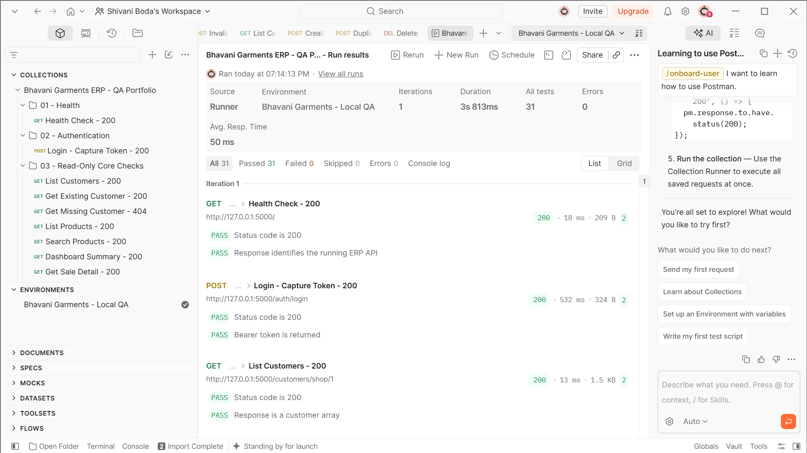
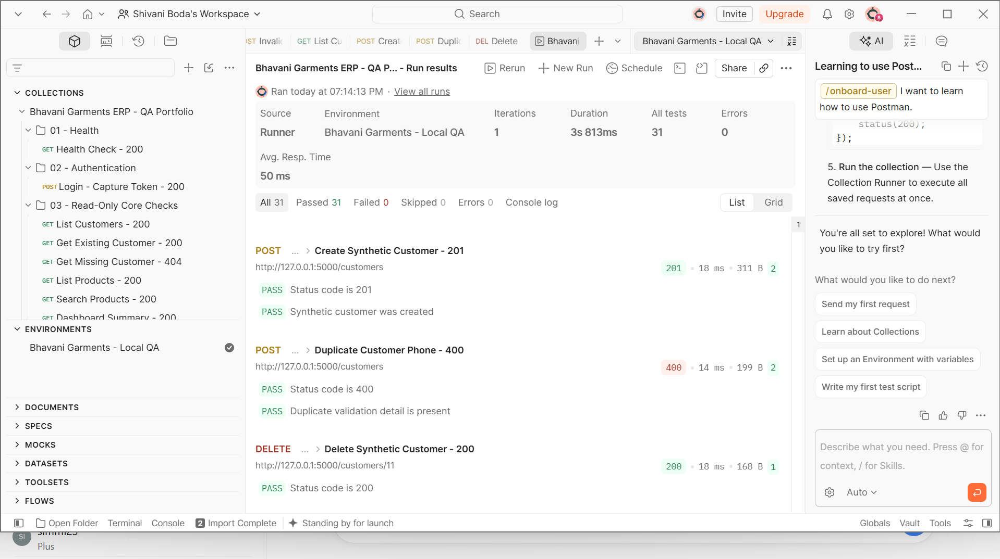

# Bhavani Garments ERP — QA Portfolio

This repository presents evidence-backed quality assurance work completed on a Flutter and FastAPI retail ERP/POS application. It is designed for QA Trainee, Junior Software Tester, and Manual Testing Trainee applications.

The portfolio demonstrates test planning, formal test-case design, exploratory and regression testing, Jira defect management, responsive UI verification, API testing with Postman, defect retesting, and requirements traceability.

## Portfolio results

| Area | Verified result |
|---|---:|
| Formal test cases | 31 passed |
| Jira defects | 5 completed |
| Open Jira defects | 0 |
| Postman requests | 16 executed |
| Postman assertions | 31 passed, 0 failed |
| Latest documented Flutter suite | 350 passed |
| HTTP contracts checked | 200, 201, 400, 401, 404, 422 |

## Included artifacts

| File | Purpose |
|---|---|
| `Bhavani_Garments_QA_Portfolio.xlsx` | Test plan, 31 formal test cases, five Jira defects, API coverage, execution results, and requirements traceability |
| `Bhavani_Garments_API.postman_collection.json` | Runnable Postman collection containing positive, negative, authentication, validation, regression, and controlled CRUD checks |
| `Bhavani_Garments_Local.postman_environment.json` | Sanitized local environment; credentials, bearer token, synthetic phone, and temporary customer ID are blank |
| `POSTMAN_EXECUTION_REPORT.md` | Postman execution summary, coverage, safety controls, cleanup, and limitations |
| `INTERVIEW_GUIDE.md` | Beginner-friendly explanations for defending the work during interviews |
| `RESUME_UPDATES.md` | Truthful skills and project bullets that may be added to a QA resume |
| `GITHUB_UPLOAD_GUIDE.md` | One-pass instructions for publishing this package safely |
| `QA_READINESS_CHECKLIST.md` | Remaining learning and application checklist |
| `.gitignore` | Prevents accidental publication of credentials, logs, databases, build output, and temporary files |
| `postman-run-summary.png` | Collection Runner evidence showing 31 passed assertions and zero errors |
| `postman-cleanup-proof.png` | Evidence for create, duplicate rejection, and deletion of the synthetic customer |
| [PostgreSQL database validation](database-testing/README.md) | 13 read-only checks; 11 passed, 2 historical quantity checks require review |

## Jira defect lifecycle evidence

The following genuine project defects were documented in the **Bhavani Garments ERP QA** Jira project and moved through:

`To Do → In Progress → Ready for QA → Done`

| Jira ID | Defect | Severity | Fix / merge | Retest evidence |
|---|---|---|---|---|
| BGQA-4 | Stock card crashes under transient zero-width constraints | High | `25dcc2a` / `b193710` | Zero-width recovery and 96 checked scroll steps passed |
| BGQA-5 | Supplier Ledger API returns 500 for mixed timezone datetimes | High | `0045561` / `d7f5779` | Live endpoint returned 200; 7 focused and 78 backend tests passed |
| BGQA-6 | Purchase Returns AppBar overflows at near-zero viewport width | Medium | `f8d7641` / `7944c00` | 26 focused and 218 full Flutter tests passed |
| BGQA-7 | Sale Return error message covers the Confirm Return action | Medium | `6631e91` / `09cec52` | 25 focused, 19 integration, and 296 full tests passed |
| BGQA-8 | Supplier Payments detail view can crash when one detail request fails | High | `7f308c7` / `e31eaf6` | 34 focused, 54 relevant regression, and 252 full tests passed |

The workbook contains the complete reproduction steps, expected and actual results, environment, root cause, resolution, status, and retest evidence.

## Testing performed

- Functional testing of customer, sales, sale-return, stock, purchase, purchase-return, supplier-payment, and dashboard workflows.
- Negative testing for missing authentication, invalid payloads, missing records, service failures, and duplicate customer data.
- Boundary testing for K/R quantities, zero-width layouts, minimum stock rules, long values, large quantities, and compact viewports.
- Responsive testing at 390 × 844, 768 × 900, 1440 × 900, and 1920 × 1080, plus selected near-zero-width transitions.
- Accessibility-oriented checks for semantic labels, readable error states, bounded text, tooltips, and minimum action targets.
- Regression testing through focused Flutter suites, related-module suites, full analysis, and full-suite execution.
- API contract testing for authentication, successful reads, missing resources, validation failures, controlled creation, duplicate rejection, and cleanup deletion.

## Postman execution

The Postman collection was executed on 2026-10-03 against the local FastAPI environment.

| Metric | Result |
|---|---:|
| Iterations | 1 |
| Requests | 16 |
| Assertions | 31 |
| Passed | 31 |
| Failed / skipped / errors | 0 / 0 / 0 |
| Duration | 3.813 seconds |
| Average response time | 50 ms |
| Cleanup | Synthetic customer deleted |
### Execution evidence





Coverage included service health, bearer-token capture, protected-route 401, customer 404, sale-return 422 validation, customer creation 201, duplicate-phone rejection 400, and cleanup deletion 200.

## Run the Postman collection locally

### 1. Start the backend

```powershell
cd "C:\Users\SHIVANI\Projects\garment-pos\backend"
.\venv\Scripts\Activate.ps1

python -m uvicorn app.main:app `
    --reload `
    --host 127.0.0.1 `
    --port 5000
```

### 2. Configure Postman

1. Import the collection and environment JSON files.
2. Select **Bhavani Garments - Local QA**.
3. Enter valid local credentials in `username` and `password`.
4. Confirm `shop_id`, `customer_id`, `sale_id`, `variant_id`, and `supplier_id` exist in the local database.
5. Set a unique synthetic phone only before running the optional mutation folder.
6. Run one iteration of the collection.
7. Clear `username`, `password`, `access_token`, `qa_customer_phone`, and `created_customer_id` after execution.

The mutation folder is intended only for a disposable local database. It must not be run against production or valuable shared data.

## QA workflow used

1. Review the business rule or UI contract.
2. Define positive, negative, boundary, responsive, and regression scenarios.
3. Prepare controlled test data and environment.
4. Execute focused checks and capture logs or HTTP evidence.
5. Record reproducible defects with severity and priority.
6. Verify the fix with a focused regression.
7. Run related-module and complete regression suites.
8. Perform manual browser verification where relevant.
9. Move the Jira ticket to Done only after successful retesting.

## Skills this portfolio supports

- Manual and exploratory testing
- Test-case design and execution
- Defect reporting and Jira workflow exposure
- Functional, negative, boundary, regression, responsive, and accessibility-oriented testing
- API testing with Postman
- HTTP status, JSON payload, and authentication validation
- STLC and Agile workflow understanding
- Git and GitHub feature-branch / pull-request workflow

## Honest scope and limitations

- This is hands-on project experience, not commercial QA employment.
- Flutter widget and integration-style tests are included, but this is not an end-to-end browser automation portfolio.
- Postman was used for local functional API checks, not performance, penetration, or production testing.
- Jira was used to document and close five real defects; this does not represent Jira administration expertise.
- TestRail and Zephyr were not used and should not be claimed.
- Real payment gateways, production load, production data, physical thermal-printer output, and device-farm coverage were outside scope.

## Safe interview summary

> I began with exploratory browser checks and Flutter regression tests, then formalized the work into an STLC-aligned test plan, 31 test cases, a traceability matrix, and five real Jira defects. I captured logs and HTTP responses, helped isolate failures, verified the fixes with focused and full regression suites, and moved the Jira defects through the QA workflow after retesting. I also built and executed a Postman collection against the local FastAPI backend. It covered bearer authentication, positive and negative status contracts, safe schema validation, and a controlled create-and-delete flow. All 31 Postman assertions passed, and the environment was sanitized afterward.

## Candidate

**Shivani Boda**  
B.Tech EEE, 2025  
Target roles: QA Trainee, Junior Software Tester, Manual Testing Trainee  
Preferred location: Hyderabad
